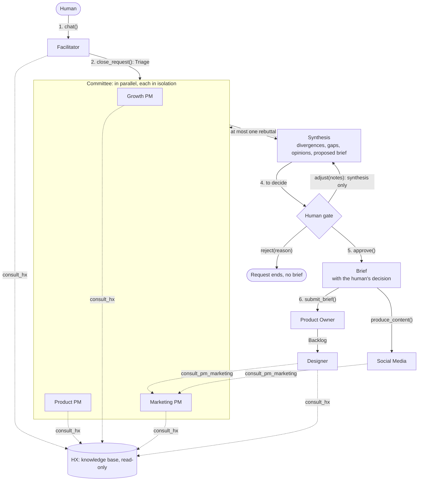

# Architecture

How the product squad works, and why it is built this way. Written for someone who has not seen the project before. Português: [architecture.pt-BR.md](architecture.pt-BR.md).

The decisions summarized here are recorded one by one in [`docs/adr/`](adr/). This page is the map; the ADRs are the detail.

## Two layers

`pydantic-squads` has two parts, and they have different jobs.

- **The core** (`pydantic_squads.role`, `.squad`, `.policies`, `.prompt`) describes a squad: who each role is, what it must not do, who it talks to, what it may write. A `Squad` is a Pydantic model, so a wrong definition fails when it is built, not when it runs. The core imports only `pydantic` ([ADR 0001](adr/0001-core-depends-only-on-pydantic.md)).
- **The product squad** (`pydantic_squads.product`) is a ready-made squad built with the core, and the runtime that turns it into agents on Pydantic AI ([ADR 0003](adr/0003-ready-made-product-squad.md)). You give it a knowledge base and a model.

The rest of this page is about the product squad.

## The flow

A request goes from a conversation to a backlog through one human decision.

Step by step:

1. **Conversation.** The human talks to the Facilitator until the request is clear. The Facilitator may consult HX. It gives no opinion.
2. **Triage.** `close_request()` asks the Facilitator to close the conversation into a `Triage`: the request restated, which PMs to hear, and why. `review(request)` starts here for a request that needs no conversation.
3. **Opinions.** The PMs picked give an `Opinion` each, at the same time, each in a run of its own. None sees another's.
4. **Synthesis.** The Facilitator consolidates the opinions into a `Synthesis`. If it finds a point the PMs disagree on, the PMs cited reply once and the synthesis is redone. That is the only rebuttal.
5. **The gate.** The human reads the synthesis and decides: `approve()`, `adjust(notes)` or `reject(reason)`.
6. **Execution.** An approved `Brief` goes to the Product Owner, which returns a `Backlog`. The Designer turns the backlog into a `Prototype`; Social Media turns the same brief into a `ContentPack`.

The human acts at two moments, the conversation and the gate. There is one decision per request.

## Roles and their boundaries

Each role is a `Role` in `pydantic_squads.product.roles`. The table is what the code enforces, not what a prompt asks for.

| Role | Mode | Talks to | Can write | Delivers |
| --- | --- | --- | --- | --- |
| Facilitator | conversational | the human, HX, the three PMs, the Product Owner | `docs/**` and `assumptions/**`, each write approved by the human | `Triage`, then `Synthesis` |
| Growth PM | task | Facilitator, HX | nothing | `Opinion` |
| Product PM | task | Facilitator, HX | nothing | `Opinion` |
| Marketing PM | task | Facilitator, HX | nothing | `Opinion`, or `MarketingGuidance` when consulted |
| HX | delegate | whoever consults it | nothing | `HXAnswer` |
| Product Owner | task | Facilitator | `squad/backlog/**` | `Backlog` or `BriefRejection` |
| Designer | task | HX, Marketing PM | `squad/design/**`; `design-system/**` with approval | `Prototype` or `SendBack` |
| Social Media | task | Marketing PM | `squad/content/**` | `ContentPack` |

A few things the table does not show:

- **Modes.** A *conversational* role talks to the human. A *task* role takes one input and returns one output. A *delegate* is called by other roles as a tool. Two default policies hold for this squad: there is exactly one conversational role, and only it talks to the human ([ADR 0002](adr/0002-invariants-vs-policies.md)).
- **No role can delete.** There is no delete permission and no delete operation on a knowledge base, anywhere.
- **The PMs do not list each other.** "No free debate" is in the graph: a PM has no edge to another PM.
- **Notes the squad writes itself.** The synthesis, the decision and the approved brief (`squad/committee/**`, `squad/briefs/**`) are written by the runtime, not by an agent's tool. No role has permission there, so no model can write a brief. They are rendered by code as Markdown for a person to read, in the squad's language ([ADR 0018](adr/0018-notes-are-markdown-for-people.md)).

## The four decisions that shape it

### HX is a tool, not a participant

HX answers questions about users from the knowledge base. Every finding is classified as evidence, assumption or gap, and every source it cites must be a note that exists.

It is a read-only query tool: each `consult_hx` call is a fresh run with no memory of the previous one, and HX cannot write.

- *Why stateless.* Several PMs consult HX at the same moment. A shared conversation would make one PM's question color another's answer.
- *Why read-only.* A researcher that keeps working notes builds a view of its own, and a researcher with a view starts to argue for it. The squad needs HX to report what the knowledge base says. When HX thinks an assumption should change, it says so as a finding, and a role with a path to the human carries it out.
- *What was dropped.* Caching answers between calls: a cache would be the memory this removes. A queue with a dedicated writer task for the knowledge base: a lock around `write` gives the same ordering without needing an event loop.

Searching the knowledge base returns short excerpts of the best matches, not whole notes; a role reads a note when it needs it. That keeps a consultation small enough to run several at once ([ADR 0015](adr/0015-search-returns-excerpts.md)).

See [ADR 0010](adr/0010-hx-is-a-read-only-query-tool.md) and [ADR 0004](adr/0004-hx-cannot-request-write-approval.md).

### The Product Owner has one door

The Product Owner takes a `Brief` and nothing else. A `Brief` is a problem, a hypothesis, a success metric, acceptance criteria, owner roles, and a `HumanDecision` whose verdict is `approved`.

`submit_brief()` validates the brief before any model runs. A missing field, or a decision that is not an approval, comes back as a `BriefRejection` naming what to fix. The Product Owner can also reject a complete brief that is too ambiguous to split into stories. It never asks questions back.

- *Why the approval is data.* Before, the approval was a convention: the method took any input and the docs asked callers to pass only an approved one. Now a brief without an approval does not validate.
- *Why it rejects instead of asking.* A Product Owner that sends questions back becomes one more voice in the discussion, and with several PMs its questions have no single role to go to.
- *What was dropped.* An alias that builds a brief from the old `Bet`: it would have to invent the human's decision.

A policy of the squad checks the door in the role graph too: no role but the Facilitator lists the Product Owner in `talks_to`. See [ADR 0011](adr/0011-brief-is-the-product-owners-only-door.md).

### The Facilitator is neutral

The role that runs the conversation has no stake in its outcome. It clarifies, triages and consolidates.

Where possible this is held by code:

- The Facilitator's conversational agent has no tool that reaches a PM. The PMs are heard only once the request is closed.
- The agent that writes the synthesis has no tool at all.
- `Synthesis` has no field for a recommendation of the Facilitator's own.
- Each divergence lists every PM's position, and a position can only be attributed to a PM that gave an opinion.
- The runtime attaches the PMs' original opinions to the synthesis, whole. A summary cannot hide what one of them said.
- The role on an `Opinion` is stamped by the runtime, not written by the model.

- *Why.* The squad used to be "the founder talks to the Growth PM". One role held the conversation, formed the only opinion and was the path to the Product Owner. A conversational agent that holds an opinion steers the conversation toward it, and the human saw one view with the disagreements already merged away.
- *What was dropped.* Letting the PMs debate freely: it costs model runs without a bound and tends to end in the last speaker's view. A separate committee class next to `ProductSquad`: the conversation is already the committee's entry, so it would have been a second object holding the same state.

See [ADR 0013](adr/0013-pm-committee-with-a-single-human-gate.md) and, for the Marketing PM and Social Media, [ADR 0012](adr/0012-marketing-pm-owns-brand-and-social-media-executes.md).

### One human gate

Everything before the gate prepares a decision. Everything after it executes one.

- `approve()` stamps the decision on the proposed brief by code. No model is called, so nothing can change between what the human read and what gets approved.
- `adjust(notes)` redoes only the synthesis, from the same opinions, and returns to the same gate. The PMs are not run again.
- `reject(reason)` ends the request. No brief exists.

The synthesis also says what the squad does not know: every gap HX reported during the round, with the question that surfaced it and the PM that asked. The Facilitator groups the gaps that say the same thing; code keeps every gap in exactly one group, and HX's own wording stays in the note.

- *Why one gate.* Approvals spread across steps are easy to grant one at a time without ever seeing the whole. One gate puts the PMs' views, their disagreements, the gaps and the proposed brief in front of the human together.
- *What it does not cover.* Writes to `docs/**`, `assumptions/**` and `design-system/**` still pause for approval one by one. Those are changes to shared knowledge, not decisions about a request.

## What is kept, and where

The knowledge base is a folder of notes (`MarkdownKnowledgeBase`) or anything that implements the `KnowledgeBase` protocol. `ProductSquad` wraps it so that writes happen one at a time.

| Path | Written by | What it is |
| --- | --- | --- |
| `squad/committee/<cycle_id>/synthesis-<n>.md` | the runtime | each synthesis the human was shown. Readable by path, never a search result |
| `squad/committee/<cycle_id>/decision.md` | the runtime | the verdict and its notes |
| `squad/briefs/<brief_id>.md` | the runtime | an approved brief, for a person to read |
| `squad/briefs/<brief_id>.json` | the runtime | the same brief as data (a `BriefRecord`) |
| `squad/backlog/**` | Product Owner | its working notes |
| `squad/design/<cycle_id>/` | Designer | the HTML prototype and `questions.md` |
| `squad/content/<cycle_id>/` | Social Media | landing-page copy and posts |
| `docs/**`, `assumptions/**` | Facilitator, with approval | shared knowledge |
| `design-system/**` | Designer, with approval | components and tokens |

A *cycle* is one request, from its conversation to what is built from its brief. With `trace_dir` set, every model and tool call of a cycle is recorded as spans in one file, and a committee round appears as one `request` span with its steps (`triage`, `fan_out`, `rebuttal`, `synthesis`) under it. `squad.gantt()` draws the current cycle from memory. See [ADR 0006](adr/0006-observability-and-checkpointing.md), [ADR 0014](adr/0014-request-steps-in-the-trace-and-a-live-gantt.md) and [gantt_visualization.md](gantt_visualization.md).

## Where the code is

| Module | What it holds | Imports `pydantic_ai` |
| --- | --- | --- |
| `pydantic_squads.role`, `.squad`, `.policies`, `.prompt` | the core | no |
| `product.roles`, `product.squad` | the eight roles, the committee, the squad's policy | no |
| `product.contracts` | every hand-off model (`Triage`, `Opinion`, `Synthesis`, `Brief`, ...) | no |
| `product.knowledge` | the `KnowledgeBase` protocol and the markdown adapter | no |
| `product.assembly` | `ProductSquad`: builds the agents, holds the state, guards the gate | yes |
| `product.committee` | one round: opinions, rebuttal, synthesis, gaps, the synthesis note | yes |
| `product.chat` | `pydantic-squads chat`: the squad as a terminal session | yes |
| `product.observability` | spans and the trace file | yes |
| `product.claude_code` | running on a local Claude Code login | yes |
| `product.skills_integration`, `product.otel` | optional skills and telemetry export | yes |
| `product.skills_config`, `product.skill_registry`, `product.skill_tools`, `product.skills_install` | a project's own skills: its config, finding them on disk, running a declared script, installing a repository (ADR 0019) | no |
| `visualization` | the terminal Gantt, standard library only | no |

Tests never call an LLM: every agent is played by a fake model, which is also why the rules above are written as code that a test can check.

## Cost

A request heard by three PMs is one triage, three opinions (each with its own HX consultations, and each consultation is a model run), and one synthesis. A divergence adds one reply per PM cited and a second synthesis. Nothing loops, so the cost of a request has an upper bound, and `usage_limits` caps every run.

Three things keep each call small: searching returns excerpts and a role reads the notes it needs ([ADR 0015](adr/0015-search-returns-excerpts.md)); the PMs are handed what HX already answered the Facilitator, so they consult it only for what that leaves open; and the prompts ask for brief answers. Each role can also run on a model of its own, with `ProductSquad(models=...)` ([ADR 0016](adr/0016-shared-evidence-brevity-and-a-model-per-role.md)).
