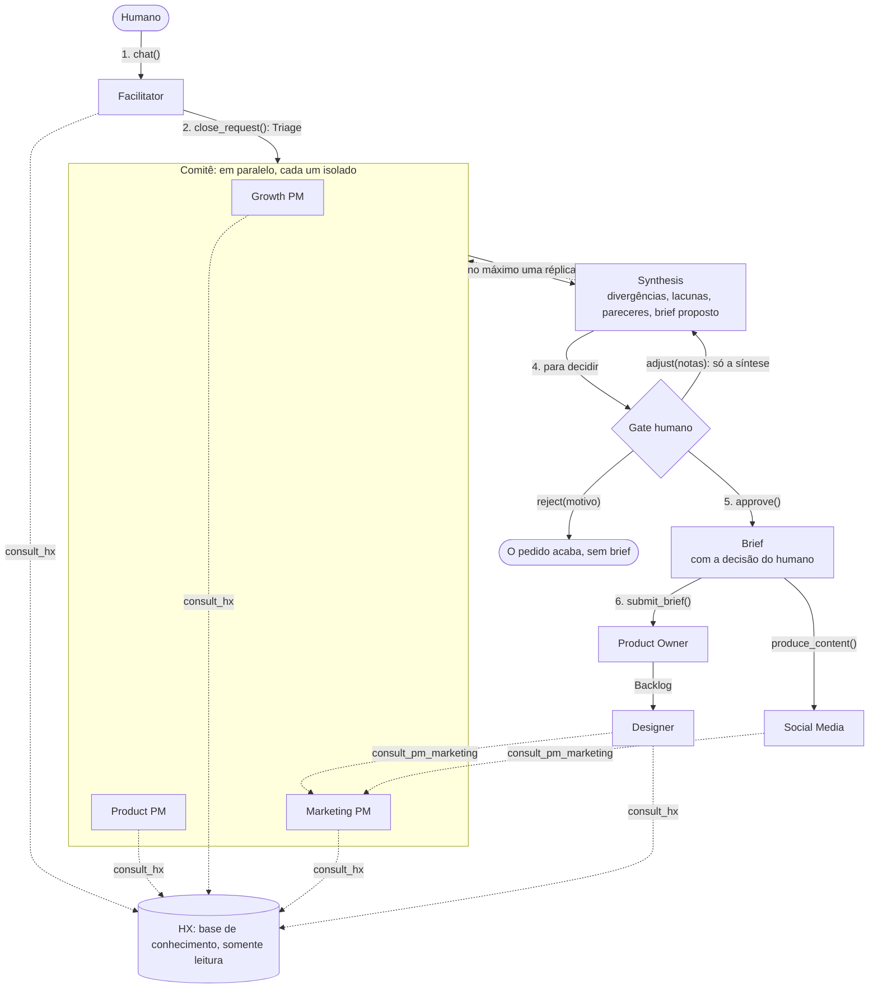

# Arquitetura

Como a squad de produto funciona, e por que foi construída assim. Escrito para quem nunca viu o projeto. English: [architecture.md](architecture.md).

As decisões resumidas aqui estão registradas uma a uma em [`docs/adr/`](adr/) (em inglês). Esta página é o mapa; as ADRs são o detalhe.

## Duas camadas

O `pydantic-squads` tem duas partes, com trabalhos diferentes.

- **O núcleo** (`pydantic_squads.role`, `.squad`, `.policies`, `.prompt`) descreve uma squad: quem é cada papel, o que ele não deve fazer, com quem fala, onde pode escrever. Uma `Squad` é um modelo Pydantic, então uma definição errada falha quando é construída, não quando roda. O núcleo importa só o `pydantic` ([ADR 0001](adr/0001-core-depends-only-on-pydantic.md)).
- **A squad de produto** (`pydantic_squads.product`) é uma squad pronta, feita com o núcleo, mais o runtime que a transforma em agentes sobre o Pydantic AI ([ADR 0003](adr/0003-ready-made-product-squad.md)). Você entrega uma base de conhecimento e um modelo.

O resto desta página é sobre a squad de produto.

## O fluxo

Um pedido vai de uma conversa até um backlog passando por uma única decisão humana.

Passo a passo:

1. **Conversa.** O humano conversa com o Facilitator até o pedido ficar claro. O Facilitator pode consultar a HX. Ele não dá parecer.
2. **Triagem.** `close_request()` pede ao Facilitator que feche a conversa numa `Triage`: o pedido reescrito, quais PMs ouvir e por quê. `review(pedido)` começa daqui, para um pedido que dispensa conversa.
3. **Pareceres.** Os PMs escolhidos dão um `Opinion` cada, ao mesmo tempo, cada um numa execução própria. Nenhum vê o do outro.
4. **Síntese.** O Facilitator consolida os pareceres numa `Synthesis`. Se encontra um ponto em que os PMs discordam, os PMs citados respondem uma vez e a síntese é refeita. Essa é a única réplica.
5. **O gate.** O humano lê a síntese e decide: `approve()`, `adjust(notas)` ou `reject(motivo)`.
6. **Execução.** Um `Brief` aprovado vai para o Product Owner, que devolve um `Backlog`. O Designer transforma o backlog num `Prototype`; o Social Media transforma o mesmo brief num `ContentPack`.

O humano age em dois momentos, a conversa e o gate. A decisão é uma só por pedido.

## Papéis e suas fronteiras

Cada papel é um `Role` em `pydantic_squads.product.roles`. A tabela mostra o que o código impõe, não o que um prompt pede.

| Papel | Modo | Fala com | Pode escrever | Entrega |
| --- | --- | --- | --- | --- |
| Facilitator | conversacional | o humano, a HX, os três PMs, o Product Owner | `docs/**` e `assumptions/**`, cada escrita aprovada pelo humano | `Triage`, depois `Synthesis` |
| Growth PM | tarefa | Facilitator, HX | nada | `Opinion` |
| Product PM | tarefa | Facilitator, HX | nada | `Opinion` |
| Marketing PM | tarefa | Facilitator, HX | nada | `Opinion`, ou `MarketingGuidance` quando consultado |
| HX | delegado | quem a consulta | nada | `HXAnswer` |
| Product Owner | tarefa | Facilitator | `squad/backlog/**` | `Backlog` ou `BriefRejection` |
| Designer | tarefa | HX, Marketing PM | `squad/design/**`; `design-system/**` com aprovação | `Prototype` ou `SendBack` |
| Social Media | tarefa | Marketing PM | `squad/content/**` | `ContentPack` |

Algumas coisas que a tabela não mostra:

- **Modos.** Um papel *conversacional* fala com o humano. Um papel de *tarefa* recebe uma entrada e devolve uma saída. Um *delegado* é chamado por outros papéis como ferramenta. Duas policies padrão valem para esta squad: existe exatamente um papel conversacional, e só ele fala com o humano ([ADR 0002](adr/0002-invariants-vs-policies.md)).
- **Nenhum papel pode apagar.** Não existe permissão de delete nem operação de delete numa base de conhecimento, em lugar nenhum.
- **Os PMs não listam uns aos outros.** O "sem debate livre" está no grafo: um PM não tem aresta para outro PM.
- **Notas que a própria squad escreve.** A síntese, a decisão e o brief aprovado (`squad/committee/**`, `squad/briefs/**`) são gravados pelo runtime, não pela ferramenta de um agente. Nenhum papel tem permissão ali, então nenhum modelo consegue escrever um brief.

## As quatro decisões que dão forma a isso

### A HX é uma ferramenta, não uma participante

A HX responde perguntas sobre usuários a partir da base de conhecimento. Cada achado é classificado como evidência, suposição ou lacuna, e cada fonte citada tem que ser uma nota que existe.

Ela é uma ferramenta de consulta somente leitura: cada chamada a `consult_hx` é uma execução nova, sem memória da anterior, e a HX não escreve.

- *Por que sem estado.* Vários PMs consultam a HX no mesmo instante. Uma conversa compartilhada faria a pergunta de um PM contaminar a resposta de outro.
- *Por que somente leitura.* Uma pesquisadora que mantém notas de trabalho forma uma visão própria, e uma pesquisadora com visão própria começa a defendê-la. A squad precisa que a HX relate o que a base de conhecimento diz. Quando a HX acha que uma suposição deveria mudar, ela diz isso como um achado, e um papel com caminho até o humano executa.
- *O que foi descartado.* Guardar respostas em cache entre chamadas: um cache seria a memória que isto remove. Uma fila com uma tarefa dedicada a escrever na base de conhecimento: um lock em volta de `write` dá a mesma ordenação sem precisar de um event loop.

Buscar na base de conhecimento devolve trechos curtos dos melhores resultados, não as notas inteiras; um papel lê a nota quando precisa dela. Isso mantém uma consulta pequena o bastante para rodar várias ao mesmo tempo ([ADR 0015](adr/0015-search-returns-excerpts.md)).

Veja a [ADR 0010](adr/0010-hx-is-a-read-only-query-tool.md) e a [ADR 0004](adr/0004-hx-cannot-request-write-approval.md).

### O Product Owner tem uma porta só

O Product Owner recebe um `Brief` e mais nada. Um `Brief` é um problema, uma hipótese, uma métrica de sucesso, critérios de aceite, papéis donos e uma `HumanDecision` cujo veredito é `approved`.

`submit_brief()` valida o brief antes de qualquer modelo rodar. Um campo faltando, ou uma decisão que não é uma aprovação, volta como um `BriefRejection` dizendo o que corrigir. O Product Owner também pode rejeitar um brief completo que seja ambíguo demais para virar histórias. Ele nunca devolve perguntas.

- *Por que a aprovação é dado.* Antes, a aprovação era uma convenção: o método aceitava qualquer entrada e a documentação pedia para só passar uma aprovada. Agora um brief sem aprovação não valida.
- *Por que ele rejeita em vez de perguntar.* Um Product Owner que devolve perguntas vira mais uma voz na discussão, e com vários PMs as perguntas dele não têm um papel único para onde ir.
- *O que foi descartado.* Um alias que montasse um brief a partir do antigo `Bet`: ele teria que inventar a decisão do humano.

Uma policy da squad confere a porta também no grafo de papéis: nenhum papel além do Facilitator lista o Product Owner em `talks_to`. Veja a [ADR 0011](adr/0011-brief-is-the-product-owners-only-door.md).

### O Facilitator é neutro

O papel que conduz a conversa não tem interesse no resultado dela. Ele esclarece, faz a triagem e consolida.

Onde dá, isso é garantido por código:

- O agente conversacional do Facilitator não tem ferramenta que alcance um PM. Os PMs só são ouvidos depois que o pedido é fechado.
- O agente que escreve a síntese não tem ferramenta nenhuma.
- `Synthesis` não tem campo para uma recomendação própria do Facilitator.
- Cada divergência lista a posição de cada PM, e uma posição só pode ser atribuída a um PM que deu parecer.
- O runtime anexa à síntese os pareceres originais dos PMs, na íntegra. Um resumo não consegue esconder o que um deles disse.
- O papel num `Opinion` é carimbado pelo runtime, não escrito pelo modelo.

- *Por quê.* A squad era "o fundador conversa com o Growth PM". Um papel só conduzia a conversa, formava o único parecer e era o caminho até o Product Owner. Um agente conversacional que tem opinião puxa a conversa para ela, e o humano via uma visão só, com as divergências já diluídas.
- *O que foi descartado.* Deixar os PMs debaterem livremente: custa execuções de modelo sem limite e tende a terminar na visão de quem falou por último. Uma classe de comitê separada do `ProductSquad`: a conversa já é a entrada do comitê, então seria um segundo objeto guardando o mesmo estado.

Veja a [ADR 0013](adr/0013-pm-committee-with-a-single-human-gate.md) e, para o Marketing PM e o Social Media, a [ADR 0012](adr/0012-marketing-pm-owns-brand-and-social-media-executes.md).

### Um único gate humano

Tudo antes do gate prepara uma decisão. Tudo depois dele executa uma.

- `approve()` carimba a decisão no brief proposto, por código. Nenhum modelo é chamado, então nada muda entre o que o humano leu e o que é aprovado.
- `adjust(notas)` refaz só a síntese, a partir dos mesmos pareceres, e volta ao mesmo gate. Os PMs não rodam de novo.
- `reject(motivo)` encerra o pedido. Não existe brief.

A síntese também diz o que a squad não sabe: cada lacuna que a HX apontou durante a rodada, com a pergunta que a revelou e o PM que perguntou. O Facilitator agrupa as lacunas que dizem a mesma coisa; o código mantém cada lacuna em exatamente um grupo, e as palavras da própria HX ficam na nota.

- *Por que um gate só.* Aprovações espalhadas pelas etapas são fáceis de dar uma a uma sem nunca ver o todo. Um gate único põe na frente do humano, juntos, as visões dos PMs, as divergências, as lacunas e o brief proposto.
- *O que ele não cobre.* Escritas em `docs/**`, `assumptions/**` e `design-system/**` continuam pausando para aprovação uma a uma. Essas são mudanças no conhecimento compartilhado, não decisões sobre um pedido.

## O que fica guardado, e onde

A base de conhecimento é uma pasta de notas (`MarkdownKnowledgeBase`) ou qualquer coisa que implemente o protocolo `KnowledgeBase`. O `ProductSquad` a embrulha para que as escritas aconteçam uma de cada vez.

| Caminho | Quem escreve | O que é |
| --- | --- | --- |
| `squad/committee/<cycle_id>/synthesis-<n>.md` | o runtime | cada síntese mostrada ao humano. Legível pelo caminho, nunca resultado de busca |
| `squad/committee/<cycle_id>/decision.md` | o runtime | o veredito e as notas |
| `squad/briefs/<brief_id>.md` | o runtime | um brief aprovado |
| `squad/backlog/**` | Product Owner | notas de trabalho dele |
| `squad/design/<cycle_id>/` | Designer | o protótipo HTML e o `questions.md` |
| `squad/content/<cycle_id>/` | Social Media | copy de landing page e posts |
| `docs/**`, `assumptions/**` | Facilitator, com aprovação | conhecimento compartilhado |
| `design-system/**` | Designer, com aprovação | componentes e tokens |

Um *ciclo* é um pedido, da conversa até o que é construído a partir do brief. Com `trace_dir` definido, cada chamada de modelo e de ferramenta de um ciclo é gravada como spans num arquivo, e uma rodada do comitê aparece como um span `request` com as suas etapas (`triage`, `fan_out`, `rebuttal`, `synthesis`) abaixo. `squad.gantt()` desenha o ciclo atual a partir da memória. Veja a [ADR 0006](adr/0006-observability-and-checkpointing.md), a [ADR 0014](adr/0014-request-steps-in-the-trace-and-a-live-gantt.md) e o [gantt_visualization.pt-BR.md](gantt_visualization.pt-BR.md).

## Onde está o código

| Módulo | O que tem | Importa `pydantic_ai` |
| --- | --- | --- |
| `pydantic_squads.role`, `.squad`, `.policies`, `.prompt` | o núcleo | não |
| `product.roles`, `product.squad` | os oito papéis, o comitê, a policy da squad | não |
| `product.contracts` | todos os modelos de handoff (`Triage`, `Opinion`, `Synthesis`, `Brief`, ...) | não |
| `product.knowledge` | o protocolo `KnowledgeBase` e o adaptador markdown | não |
| `product.assembly` | `ProductSquad`: monta os agentes, guarda o estado, protege o gate | sim |
| `product.committee` | uma rodada: pareceres, réplica, síntese, lacunas, a nota da síntese | sim |
| `product.observability` | spans e o arquivo de trace | sim |
| `product.claude_code` | rodar num login local do Claude Code | sim |
| `product.skills_integration`, `product.otel` | skills opcionais e exportação de telemetria | sim |
| `visualization` | o Gantt no terminal, só biblioteca padrão | não |

Os testes nunca chamam um LLM: cada agente é interpretado por um modelo falso, e é também por isso que as regras acima estão escritas como código que um teste consegue verificar.

## Custo

Um pedido ouvido por três PMs é uma triagem, três pareceres (cada um com as suas consultas à HX, e cada consulta é uma execução de modelo) e uma síntese. Uma divergência acrescenta uma réplica por PM citado e uma segunda síntese. Nada entra em laço, então o custo de um pedido tem teto, e `usage_limits` limita cada execução.

Três coisas mantêm cada chamada pequena: a busca devolve trechos e o papel lê as notas de que precisa ([ADR 0015](adr/0015-search-returns-excerpts.md)); os PMs recebem o que a HX já respondeu ao Facilitator, e só a consultam para o que isso deixa em aberto; e os prompts pedem respostas curtas. Cada papel também pode rodar num modelo próprio, com `ProductSquad(models=...)` ([ADR 0016](adr/0016-shared-evidence-brevity-and-a-model-per-role.md)).
